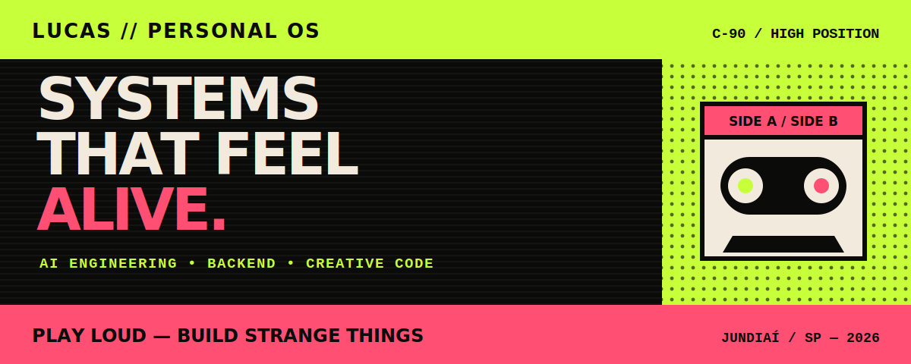

<div align="center">



[](https://lucas-personal-os.reskyume.chatgpt.site)
[](#side-a--dev-system)
[](#side-b--producer)
[](https://github.com/Rukafuu/PortfolioAB)

`C-90 / HIGH POSITION` · `JUNDIAÍ—SP` · `PLAY LOUD`

</div>

---

<table>
<tr>
<td width="50%" valign="top">

### SIDE A // DEV SYSTEM

**Engenharia de IA, backend e software que parece vivo.**

Agentes, voz, memória, ferramentas autônomas, produtos digitais e experiências construídas entre pesquisa e produção.

</td>
<td width="50%" valign="top">

### SIDE B // PRODUCER

**Rukafuu em frequências eletrônicas.**

Melodic dubstep, future bass, trilhas cinematográficas, texturas agressivas e pequenos mundos sonoros gravados de madrugada.

</td>
</tr>
</table>

> **NÃO SÃO DUAS IDENTIDADES. É A MESMA FITA TOCANDO DOS DOIS LADOS.**

## TRACK 01 — SYSTEM ID

Este é o portfólio pessoal de **Lucas Frischeisen**, também conhecido como **Rukafuusca** no código e **Rukafuu** na música.

O projeto abandona a estrutura tradicional de portfólio e transforma a navegação em um deck de fita cassete. O visitante pode alternar entre os lados, tocar músicas reais, explorar projetos, conversar com a Lira e encontrar transmissões escondidas pelo sistema.

<table>
<tr>
<td><strong>FORMAT</strong></td>
<td>Portfólio interativo / cassete C-90</td>
</tr>
<tr>
<td><strong>STACK</strong></td>
<td>React · TypeScript · Vinext · Cloudflare Workers · D1</td>
</tr>
<tr>
<td><strong>SIGNAL</strong></td>
<td>IA · backend · música · narrativa digital</td>
</tr>
<tr>
<td><strong>RELEASE</strong></td>
<td><a href="https://lucas-personal-os.reskyume.chatgpt.site">lucas-personal-os.reskyume.chatgpt.site</a></td>
</tr>
</table>

## TRACK 02 — WHAT'S ON THE TAPE

- Cassete animada sincronizada à reprodução real das faixas.
- **Lado A** com projetos, currículo, blog e atuação em engenharia de IA.
- **Lado B** com a discografia autoral de Rukafuu no SoundCloud.
- Player com play, pause, anterior, próxima faixa e sequência automática.
- Terminal navegável com comandos, rotas escondidas e interferências ocasionais.
- Liner notes transformadas em blog técnico com links individuais compartilháveis.
- Projetos atualizados usando a API pública do GitHub.
- Currículo disponível no próprio site, em PDF e DOCX.
- Layout responsivo pensado para toque, teclado e safe areas do iOS.

## TRACK 03 — LIRA PUBLIC SIGNAL

<table>
<tr>
<td width="72%" valign="top">

Uma instância pública da **Lira** vive dentro do portfólio.

Ela conversa com visitantes, preserva uma sessão limitada, expõe o estado real do sinal e possui respostas especiais escondidas. A interface não tenta fingir que é um chat genérico: ela faz parte da narrativa do sistema.

`/api/lira` · Workers AI · D1 · fallback resiliente · easter eggs

</td>
<td width="28%" align="center" valign="middle">

### SIGNAL

🟢 **ONLINE**

`MEMORY: SESSION`

</td>
</tr>
</table>

## TRACK 04 — SELECTED PROJECTS

| REC | PROJETO | SINAL |
|:---:|---|---|
| `01` | [LiraVtuber](https://github.com/Rukafuu/LiraVtuber) | Voz · memória híbrida · ferramentas · Live2D |
| `02` | [CAFUNÉ](https://github.com/Rukafuu/CAFUNE) | SNN · Transformer · RLAIF |
| `03` | [Xodó Studio](https://github.com/Rukafuu/xodo-ide) | IDE para criar e depurar agentes visualmente |
| `04` | [PortarIA](https://github.com/Rukafuu/PortarIA) | Reconhecimento facial · liveness ativo |
| `05` | [Above All Graphs](https://github.com/thewaifucorp) | Contexto estrutural para agentes de código |
| `06` | [wAIfu Corp](https://waifucorp.org/) | Coletivo open source · IA experimental |

## SIDE B — PRODUCER

> **RUKAFUU // ORIGINAL RECORDINGS // NO SKIPS**

| TRACK | TITLE | STATE |
|:---:|---|:---:|
| `01` | Horizonte | PLAYING |
| `02` | Piraña | LOADED |
| `03` | Paranoid | LOADED |
| `04` | Unspoken | LOADED |
| `05` | Hyperbloom | LOADED |
| `06` | Mosquitoes Invasion | LOADED |

<div align="center">

[](https://soundcloud.com/rukafuu)

</div>

## TRACK 05 — BOOT SEQUENCE

Requer **Node.js 22.13+**.

```bash
git clone https://github.com/Rukafuu/PortfolioAB.git
cd PortfolioAB
npm install
npm run dev
```

Abra `http://localhost:5173` e pressione play.

### Verificação

```bash
npm test
```

O comando executa a build de produção e valida o comportamento principal, o layout mobile e as transmissões escondidas.

### Publicação no Cloudflare Workers

```bash
npm run build
npx wrangler deploy --config dist/server/wrangler.json
```

## HIDDEN TRACK — TERMINAL

O botão `>_` não está ali apenas para decoração.

```text
lucas@tape:~$ help
lucas@tape:~$ projects
lucas@tape:~$ music
lucas@tape:~$ lira
lucas@tape:~$ alice
```

Algumas faixas não aparecem no encarte.

---

<div align="center">

### LUCAS // PERSONAL OS

**GRAVADO ENTRE JUNDIAÍ, UM TERMINAL ABERTO DE MADRUGADA E UMA FITA QUE AINDA GIRA.**

`SIDE A: DEV` · `SIDE B: PRODUCER` · `REWIND IS NOT AN OPTION`

</div>
